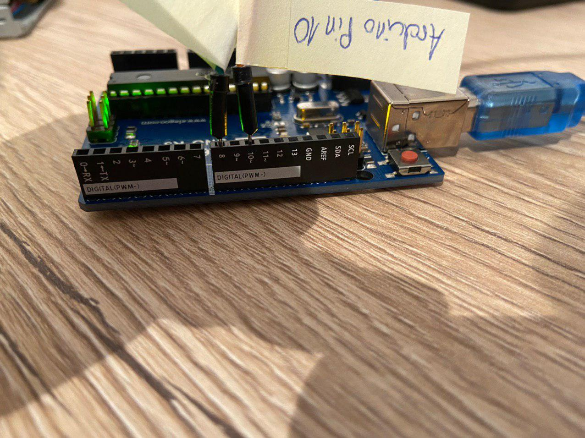

# pr0gramm Wichteln 2019

Hallo **useruser**!

Ich hoffe dir hat mein Wichtelpaket bis hierhin gefallen. Die folgenden Kapitel sollten viele deiner Fragen über das *Programmieren*, das *Arduino-Board* und den *Floppotron* klären :) Falls nicht schreib mir einfach ne pm ;)

Wenn du jetzt erstmal das Floppylaufwerk zum Musizieren bringen willst, dann gehe einfach zum Kapitel [Der Floppotron](#Der-Floppotron) ;)

# Inhaltsverzeichnis
1. [Was ist das hier?](#Was-ist-das-hier?)
2. [Wie und wo fange ich mit Programmieren am besten an?](#Wie-und-wo-fange-ich-mit-Programmieren-am-besten-an?)
2. [Quickstart: Arduino](#Quickstart-Arduino)
3. [Der Floppotron](#Der-Floppotron)
---

## Was ist das hier?
Erstmal zur Website selbst: GitHub stellt seinen Nutzern die Möglichkeit bereit in sogenannten *Repositories* den Quellcode ihrer Softwareprojekte zu verwalten. Dafür wird das Versionsverwaltungssystem *Git* genutzt, was jedoch erstmal uninteressant ist. 

Viel wichtiger sind die *Arduino-Projekte* die sich in den Dateien und Verzeichnisse hier verbergen, sowie dieses Dokument. Letzters soll dir als Startrampe in die Welt des Programmieren dienen :) 

## Wie und wo fange ich mit Programmieren am besten an?
Das ist eine sehr gute Frage! Es gibt sehr viele Programmiersprachen von denen du sicherlich schonmal irgendwo etwas gehört hast. Am [beliebtesten](https://fossbytes.com/most-popular-programming-languages/) sind:

* [C++](https://www.wikiwand.com/de/C%2B%2B): von C++ in seiner "Reinform" würde ich als Anfänger abraten. Im Bezug auf Arduinos kann man da ne Ausnahme machen, das sind die Tutorial deutlich einfacher ;)
* [Java](https://www.wikiwand.com/de/Java_(Programmiersprache)): Meiner Meinung nach für Anfänger gut geeignet. Es gibt sehr gute Tutorials auf YouTube die dich in das Thema Java einführen. 
* [Python](https://www.wikiwand.com/de/Python_(Programmiersprache)): Ebenfalls sehr gut für Einsteiger geeignet. Ein kurzes Python-Programm lässt sich sehr schnell schreiben, da es mit wenig Overhead auskommt

Was du garantiert brauchen wirst sind gute Englischkenntnisse, da die meisten Inhalte auf Englisch sind. Die geeignetste Anlaufstelle sind wahrscheinlich YouTube-Tutorials. Hier werden dir eigentlich alles Schritt für Schritt erklärt. Falls doch mal etwas unklar ist, hilft meistens eine Google-Suche.

### Tutorials:
* Arduino: ***←** Fang am besten hier an :) Java und / oder Python kannst du dir anschauen wenn es dich interessiert*
    * [You can learn Arduino in 15 minutes](https://www.youtube.com/watch?v=nL34zDTPkcs) 
    * [Arduino Course for Absolute Beginners](https://www.youtube.com/playlist?list=PLZfay8jtbyJt6gkkOgeeapCS_UrsgfuJA)
    * [Die wesentlichen Bestandteile der Arduino-Programmiersprache](https://www.arduino.cc/reference/de/)
* Java: 
    * [Java Tutorial for Beginners [2019]](https://www.youtube.com/watch?v=eIrMbAQSU34)
* Python:
    * [Lerne Python - Komplett Kurs für Anfänger](https://www.youtube.com/watch?v=rfscVS0vtbw)

## Quickstart Arduino
Am besten lädst du dir die [Arduino IDE](https://www.arduino.cc/en/Main/Software) für dein Betriebssystem runter. **IDE** steht für **Integrated Development Environment** bzw. *Integrierte Entwicklungsumgebung*. 

Das ist einfach gesagt ein Programm, das dir das Programmieren deutlich erleichtert in dem es beispielsweise deinen geschriebenen Code farblich markiert und dadruch lesbarer macht, oder auch eine Verbindung zum Arduino aufbaut um den Code zu übertragen. So sieht die *IDE* mit einem geöffneten Projekt aus:

Sobald du das Programm runtergeladen und gestartet hast, kannst du deinen Arduino (bzw. Elegoo) Uno an deinen Rechner anschließen. Ich bin mir gerade nicht sicher ob er automatisch erkannt wird, deshalb mache sicherheitshalber folgendes:

1. Klicke oben auf den Reiter Werkzeuge und wähle deinen Board-Type aus: **Arduino/Genuino Uno**
    
2. Wähle den Port aus über den das Board angeschlossen ist. Ist üblicherweise nur einer, anderenfalls trenne die Verbindung zum Arduino und schaue welcher COM Port verschwunden ist.
    

Um zu testen ob alles funktioniert kannst du ein Programm ans Arduino übertragen. Dazu eignet sich der Code unter diesem Abschnitt ;) Dieser Code bringt die eingebaute LED im 500ms Takt zum Blinken. Kopiere das einfach in deine *IDE* und speichere es ab.

    /* 
     * Diese Methode wird einmalig und als erstens aufgerufen. Sie dient zur Initialisierung
     */
    void setup() {
        // Der Pin der eingbauten LED soll ein Ausgabepin sein
        pinMode(LED_BUILTIN, OUTPUT);
    }

    /* 
     * Diese Methode wird endlos wiederholt
     */
    void loop() {
        digitalWrite(LED_BUILTIN, HIGH);  // LED anschalten 
        delay(500);                       // Halbe Sekunde (500ms) warten
        digitalWrite(LED_BUILTIN, LOW);   // LED ausschalten
        delay(500);                       // Halbe Sekunde (500ms) warten
    }

 Sobald das erledigt ist kannst du auf den Knopf mit dem Pfeil nach rechts klicken:

 

Nun sollte das Programm an deinen Arduino übertragen worden sein und die interne LED blinken :)

Weitere Projekte findes du [hier](/projects) im Projects Verzeichnis

## Der Floppotron
Im folgenden Kapitel werden Funktionsweise und Aufbau des Floppotrons näher erläutert.

### Funktionsweise
Das ist eigentlich ganz einfach. Floppylaufwerke haben einen Lesekopf der über einen Schrittmotor vor und zurück gefahren werden kann. Der Motor bzw. der Lesekopf wird dabei missbraucht um einen Ton zu erzeugen, in dem man ihn mit einer bestimmten Frequenz bewegt. 

Auf dem Arduino ist eine Abfolge von Frequenzen mit dazugehörigen Tonlängen (also wie lange ein Ton gespielt werden soll) gespeichert. Diese werden nacheinander abgespielt um eine Melodie zu erzeugen. 

Damit aus einer Frequenz ein Ton wird, wird zuerst die Frequenz in µSekunden umgerechnet. Dann muss man den Lesekopf bzw. Motor nur alle ***x*** µs bewegen und man hört den entsprechenden Ton. 

    Beispiel mit Kammerton A4:
    Frequenz: 440Hz
    Dauer in µSekunden: 1.000.000 / 440 Hz = ~2273µs
    
    --> Motor alle 2273µs einmal bewegen zum Erzeugen des Tons A4
    
Eine kleines Problem stellt das Bewegen des Lesekopfes dar, irgendwann ist er am Ende angelangt. Um zu wissen wann man den Motor rückwärts drehen muss, können die Schritte gezählt werden, die der Motor tätigt. An den Floppys mit denen ich gearbeitet habe war nach *82* Schritten Schluss. 
Wenn nun z.B. 82 Schritte erreicht wurden, wird der Motor einfach in die andere Richtung gedreht und das zählen beginnt von vorne.
    
    

### Aufbau
Trenne zu Beginn das Arduino-Board vom Strom und lege das Floppylaufwerk auf einen glatten, festen Untergrund (Schreibtisch, Fußboden, etc.)

Der Aufbau ist ganz einfach, es werden nur vier Kabel benötigt. Im Idealfall sind diese noch mit Label am Floppy dran. Falls sie während des Transport abgefallen sind, siehst du in den Bildern unten wie du sie anschließen musst. 

Ich habe die nicht relevanten Floppy-Pins mit einem Filzstift schwarz angemalt (auf dem Bild war das allerdings noch nicht so). 

Zwei der vier Kabel, **5* Volt* und *Ground*, dienen als Stromversorgung für das Laufwerk. Die anderen beiden dienen zum Steuern des Motors. Der **Dir**-Pin gibt an in welche Richtung sich der Motor drehen soll, der **Step**-Pin lässt den Motor bei einem Wechsel von **LOW** auf **HIGH** um einen Schritt drehen.  

Anzuschließen sind die Kabel am Arduino wie folgt:

 

Sobald alles angeschlossen ist kannst du das Arduino wieder mit Strom verbinden und es sollte eine Melodie spielen. Über den kleinen roten Knopf neben dem USB-Port kannst du das Arduino zurücksetzen und das Programm darauf neustarten ;) 

Falls keine Melodie spielt stelle sicher, dass alle Kabel fest sitzen und die grüne LED des Floppylaufwerks leuchtet (wie im GIF zu sehen). Falls das Laufwerk mal nichts tut und die LED leuchtet hilft es, das Floppy vom Strom zu trennen.